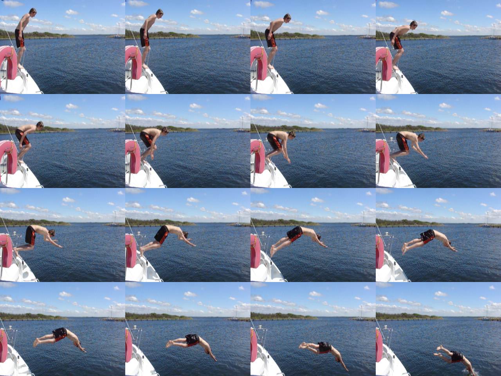

Put the script inside the folder containing the photos and run it:
./imagick-multiburst-to-gif.py <ticks> (defaults to 50 if none given, give smaller value for faster gifs and vice versa)

(The script assumes the images are in JPEG format and are the ONLY jpeg files in the pwd)

")
